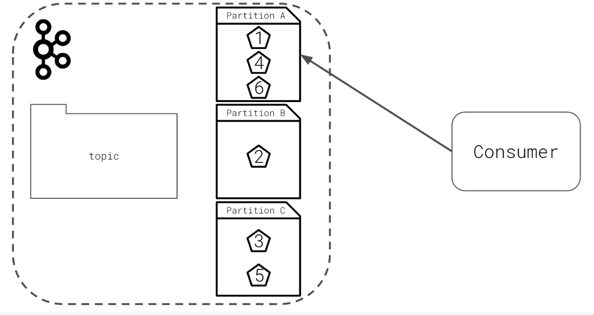

## Partitioning Topics Tips and Equation
- The “right” number of partitions is highly dependent on the scenario.
- The most important number to understand is desired throughput. How many MB/s do you need to achieve to hit your goal?
- You can easily add partitions at a later date by modifying a topic.
- Partitions have performance consequences. They require additional networking latency and potential rebalances, leading to unavailability.
- Determine the number of partitions you need by dividing the overall throughput you want by the throughput per single consumer partition or the throughput per single producer partition. Pick the larger of these two numbers to determine the needed number of partitions.  
`# Partitions = Max(Overall Throughput/Producer Throughput, Overall Throughput/Consumer Throughput)`
- Example from video, with 3 Producers and 5 Consumers, each operating at 10MB/s per single producer/consumer partition: Max(100MBs/(3 * 10MB/s), 100MBs/(5 * 10MB/s)) = Max(2) ~= *4 partitions needed*
- [Considerations in choosing the number of partitions](https://www.confluent.io/blog/how-choose-number-topics-partitions-kafka-cluster)
- Ordering is guaranteed only within a topic’s partitions
