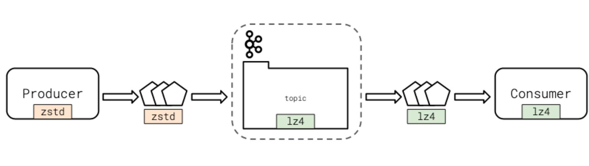

## Producer Configuration Options - Summary
- All available settings for the confluent_kafka_python library can be found in the librdkafka configuration options. confluent_kafka_python uses librdkafka under the hood and shares the exact configuration options in this document.
- It is a good idea to always set the **client.id** for improved logging, debugging, and resource limiting
- The **retries** setting determines how many times the producer will attempt to send a message before marking it as failed
- If ordering guarantees are important to your application and you’ve also enabled retries, make sure that you set **enable.idempotence to true**
- Producers may choose to compress messages with the **compression.type** setting
- Options are none, gzip, lz4, snappy, and zstd
- Compression is performed by the producer client if enabled
- If the topic has its own compression setting, it **must match** the producer setting, otherwise the broker will decompress and recompress the message into its configured format.
- The **acks** setting determines how many In-Sync Replica (ISR) Brokers need to have successfully received the message from the client before moving on
- A setting of -1 or all means that all ISRs will have successfully received the message before the producer proceeds
- Clients may opt to set this to 0 for performance reasons
- The diagram below illustrates how the topic and producer may have different compression settings. However, the setting at the topic level will always be what the consumer sees.

## Message Compression Types - Advantages and Disadvantages
See this Cloudflare Blog Post for an excellent summary of compression type pros and cons.

Here is a quick survey of the compression types and their characteristics:

|Algorithm|Pros|Cons|
|---|---|---|
|lz4	|fast compression and decompression|not a high compression ratio|
|snappy	|fast compression and decompression|not a high compression ratio|
|zstd	|high compression ratio|not as fast as lz4 or snappy|
|gzip	|ubiquitous, widely-supported	|cpu-intensive, significantly slower than lz4 or snappy|

## Optional Further Reading on Kafka Producers
[confluent-kafka-python/librdkafka Configuration Options](https://github.com/edenhill/librdkafka/blob/master/CONFIGURATION.md)
[Apache Documentation on Producer Configuration](https://kafka.apache.org/documentation/#producerconfigs)
[confluent-kafka-python Producer class](https://docs.confluent.io/current/clients/confluent-kafka-python/index.html?highlight=serializer#producer)