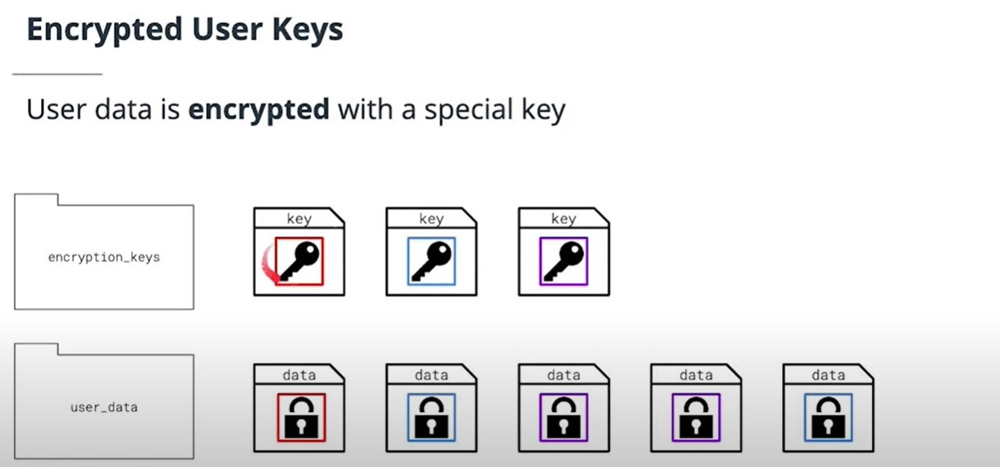
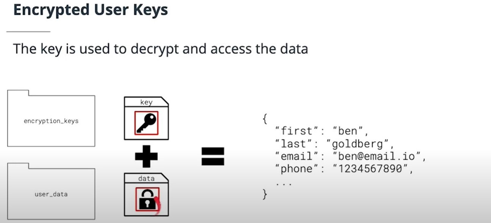
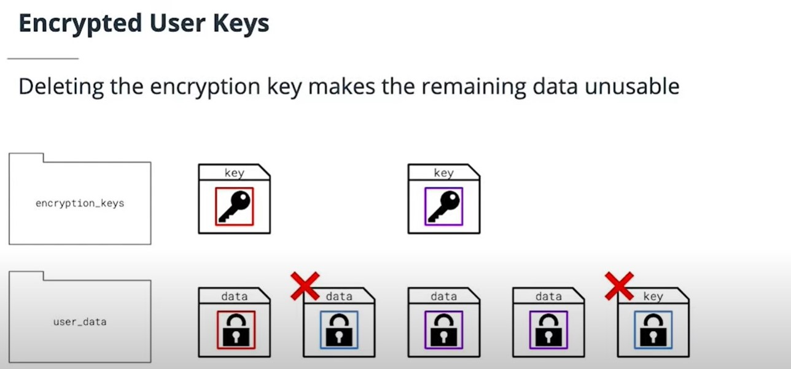

## Removing Records and Data Privacy
Removing data from Kafka requires special planning and consideration, since it utilizes an append-only log. In this section you will learn about strategies and privacy regulations related to removing Kafka records.

- Message Expiration : the simplest option to delete records
- Log compaction - null messages in a compacted topic delete the data for the key
    - log {a:"1"}, log {b:"2"}, log {c:"3"}, log {a:null}
    - compaction result: log {b:"2"}, log {c:"3"}
    - Log compaction is not good enough : when user id is not key, or user info is spread through topics

## Per-User Key encryption by Daniel Lebrero

## Deleting Records and User Privacy Summary
- Privacy regulations like GDPR and CCPA are increasingly common and require applications to give users the right to be forgotten
- You can accomplish this with message expiration on topics that is of shorter duration than your requirement
- You may also use log compaction with null messages to delete data
The best approach is to use Daniel Lebrero’s Encrypted User Keys strategy

## Optional Further Research - Removing Records and Data Privacy  
[Confluent blog post on GDPR and the right to be forgotten](https://www.confluent.io/blog/handling-gdpr-log-forget/)  
[Daniel Lebrero’s Encrypted User Keys strategy](https://danlebrero.com/2018/04/11/kafka-gdpr-event-sourcing/)