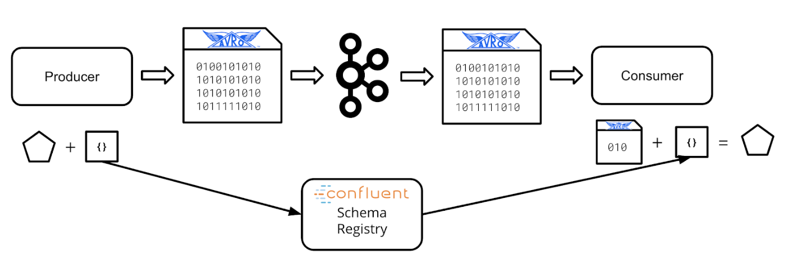

## Schema Registry

[Confluent Schema Registry](https://docs.confluent.io/current/schema-registry/index.html) is an open-source tool that provides centralized Avro Schema storage. In this section, you’ll learn how Schema Registry can improve your Kafka Stream Processing applications.

- Producer sends a schema to schema registry
- Schema registry assigns the schema a version number
- Schema registry store it in a private topic
- Until the schema definition is updated or changed, the Kafka producer doesn't need to send the schema again
- Consumer will fetch schemas as needed from registry
- Does not support deletes by default
- Has an HTTP REST interface

## Schema Registry Architecture
- Built in Scala and Java, runs on the JVM
- Stores all of its state in Kafka topics, not in a database
- Expose an HTTP web-server with a REST API
- can run standalone or clustered with many nodes
- uses Zookeeper to choose leader in cluser mode

