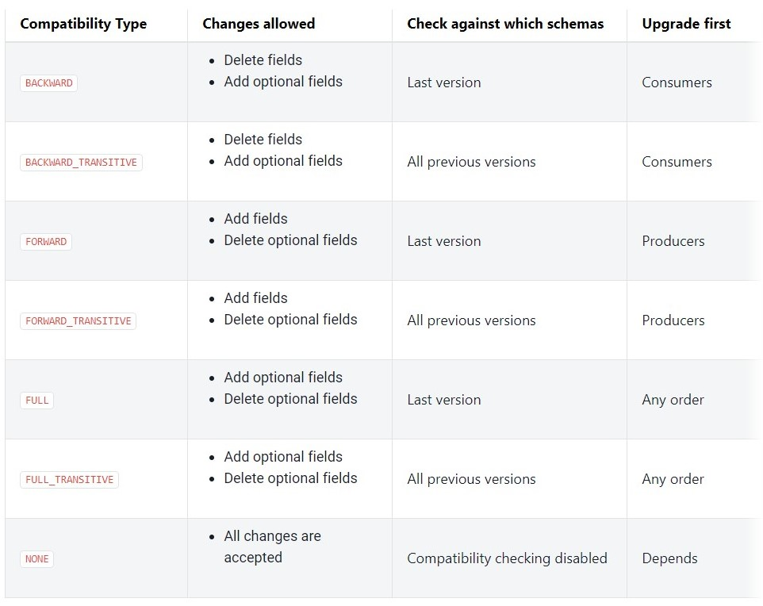

## Schema Evolution and Compatibility
Schemas change over time with new requirements. This process of schema change is known as Schema Evolution.

In this section, you will see how Avro and Schema Registry can aid in the process of Schema Evolution.

We’ll also discuss in this series of concepts how evolving schemas can be forward or backward compatible with previous versions.


## Schema Compatibility
- Schema Registry tracks compatibility between schema versions
- if the schema is compatible, the consumer continues consumption
- if not compatible, the consumer will cease consumption


*table from confluent.io*

## Backward Compatibility
- [Backward compatibility](https://docs.confluent.io/current/schema-registry/avro.html#backward-compatibility)  means that consumers using the new schema can read data produced with the last schema. For example, if there are three schemas for a subject that change in order X-2, X-1, and X then BACKWARD compatibility ensures that consumers using the new schema X can process data written by producers using schema X or X-1, but not necessarily X-2. If the consumer using the new schema needs to be able to process data written by all registered schemas, not just the last two schemas, then use BACKWARD_TRANSITIVE instead of BACKWARD. For example, if there are three schemas for a subject that change in order X-2, X-1, and X then BACKWARD_TRANSITIVE compatibility ensures that consumers using the new schema X can process data written by producers using schema X, X-1, or X-2.
    - `BACKWARD: consumer using schema X can process data produced with schema X or X-1`
    - `BACKWARD_TRANSITIVE: consumer using schema X can process data produced with schema X, X-1, or X-2`

- For example, an application can evolve the user schema from the previous section to the following by adding a new field favorite_color:
    ```
    {
        "namespace": "example.avro",
        "type": "record",
        "name": "user",
        "fields": [
            {"name": "name", "type": "string"},
            {"name": "favorite_number",  "type": "int"},
            {"name": "favorite_color", "type": "string", "default": "green"}
        ]
    }
    ```
- Note that the new field favorite_color has the default value “green”. This allows data encoded with the old schema to be read with the new one. The default value specified in the new schema will be used for the missing field when deserializing the data encoded with the old schema. Had the default value been omitted in the new field, the new schema would not be backward compatible with the old one since it’s not clear what value should be assigned to the new field, which is missing in the old data.

- The deletion of a field or the addition of a new optional field are backward compatible changes.
- Update consumers before updating producers to ensure that consumers can handle the new data type
- The BACKWARD compatibility type indicates compatibility with the current version (N) and the immediately prior version (N-1)
- Unless you specify otherwise, Schema Registry always assumes that changes are BACKWARD compatible
- The BACKWARD_TRANSITIVE compatibility type indicates compatibility with all prior versions (1 → N)

## Forward Compatibility
- [Forward compatibility](https://docs.confluent.io/current/schema-registry/avro.html#forward-compatibility) means that data produced with a new schema can be read by consumers using the last schema, even though they may not be able to use the full capabilities of the new schema. For example, if there are three schemas for a subject that change in order X-2, X-1, and X then FORWARD compatibility ensures that data written by producers using the new schema X can be processed by consumers using schema X or X-1, but not necessarily X-2. If data produced with a new schema needs to be read by consumers using all registered schemas, not just the last two schemas, then use FORWARD_TRANSITIVE instead of FORWARD. For example, if there are three schemas for a subject that change in order X-2, X-1, and X then FORWARD_TRANSITIVE compatibility ensures that data written by producers using the new schema X can be processed by consumers using schema X, X-1, or X-2.

    - `FORWARD: data produced using schema X can be read by consumers with schema X or X-1`
    - `FORWARD_TRANSITIVE: data produced using schema X can be read by consumers with schema X, X-1, or X-2`

- The deletion of an optional field or the addition of a new field are forward compatible changes
- Producers need to be updated before consumers
- The FORWARD compatibility type indicates that data produced with the latest schema (N) is usable by consumers using the previous schema version (N-1)
- The FORWARD_TRANSITIVE compatibility type indicates that data produced with the latest schema (N) is usable by all consumers using any previous schema version (1 → N-1)

## Full Compatibility
- [Full compatibility](https://docs.confluent.io/current/schema-registry/avro.html#full-compatibility) means schemas are both backward and forward compatible. Schemas evolve in a fully compatible way: old data can be read with the new schema, and new data can also be read with the last schema. For example, if there are three schemas for a subject that change in order X-2, X-1, and X then FULL compatibility ensures that consumers using the new schema X can process data written by producers using schema X or X-1, but not necessarily X-2, and that data written by producers using the new schema X can be processed by consumers using schema X or X-1, but not necessarily X-2. If the new schema needs to be forward and backward compatible with all registered schemas, not just the last two schemas, then use FULL_TRANSITIVE instead of FULL. For example, if there are three schemas for a subject that change in order X-2, X-1, and X then FULL_TRANSITIVE compatibility ensures that consumers using the new schema X can process data written by producers using schema X, X-1, or X-2, and that data written by producers using the new schema X can be processed by consumers using schema X, X-1, or X-2.

    - `FULL: backward and forward compatibile between schemas X and X-1`
    - `FULL_TRANSITIVE: backward and forward compatibile between schemas X, X-1, and X-2`

- In some data formats, such as JSON, there are no full-compatible changes. Every modification is either only forward or only backward compatible. But in other data formats, like Avro, you can define fields with default values. In that case adding or removing a field with a **default value** is a fully compatible change.
- Changing the default value for a field is an example of a full compatible change.
- The order in which producers or consumers are updated does not matter.
- The FULL compatibility type indicates that data produced is both forward and backward compatible with the current (N) and previous (N-1) schema.
- The FULL_TRANSITIVE compatibility type indicates that data produced is both forward and backward compatible with the current (N) and all previous (1 → N-1) schemas.

## No Compatibility (NONE Compatibility)
- [No compatibility](https://docs.confluent.io/current/schema-registry/avro.html#no-compatibility-checking) disables compatibility checking by Schema Registry.
    - NONE compatibility type means schema compatibility checks are disabled.
    - In this mode, Schema Registry simply becomes a schema repository.
- Use of NONE compatibility is not recommended.
- Schemas will sometimes need to undergo a change that is neither forward nor backward compatible.
- Best practice is to create a new topic with the new schema and update consumers to use that new topic.
- Managing multiple incompatible schemas within the same topic leads to runtime errors and code that is difficult to maintain.

## Optional Further Research on Schema Evolution and Compatibility  
[Confluent’s Schema Evolution and Compatibility Documentation](https://docs.confluent.io/current/schema-registry/avro.html#schema-evolution-and-compatibility)  
[Avro Schema Resolution Rules for backward compatibility](http://avro.apache.org/docs/1.8.2/spec.html#Schema+Resolution)