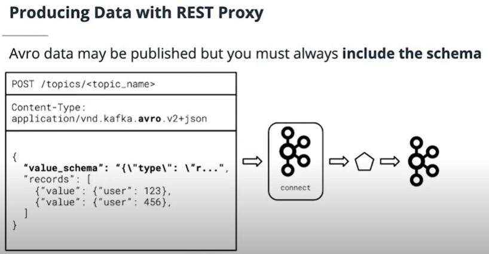
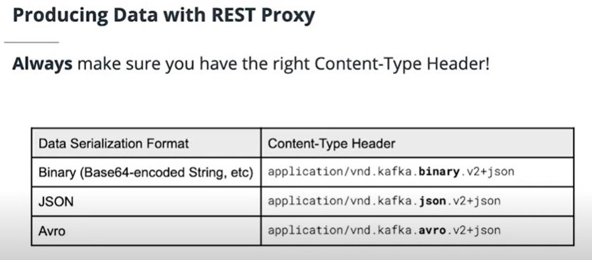

## Using REST Proxy
In this section you will see first-hand how to produce and consume data with the Kafka REST Proxy. Though REST Proxy is conceptually similar to traditional Kafka clients, we will highlight some of the important differences and considerations.

## REST Proxy Producer

- POST data to /topics/<topic_name> to produce data)
- The Kafka data may be POSTed in Binary, JSON, or Avro
- When sending Avro data you must always include the schema data as a **string** (string that contains json info)
- Always check your Content-Type header to ensure that it is correctly configured

- Content-Type is in the format application/vnd.kafka[.embedded_format].[api_version]+[serialization_format]
- embedded_format is how the data destined for Kafka is formatted. Must be one of binary, json, or avro
- api_version is the API version for REST Proxy -- this should always be v2 as of this writing
- serialization_format has nothing to do with your Kafka data, this is how the actual data being sent to REST proxy is serialized. Only json is supported for now -- so always set this to json!
- When using REST Proxy, always start by ensuring that the Content-Type is correctly set before running your code. A misconfigured Content-Type can lead to confusing and hard-to-debug errors.