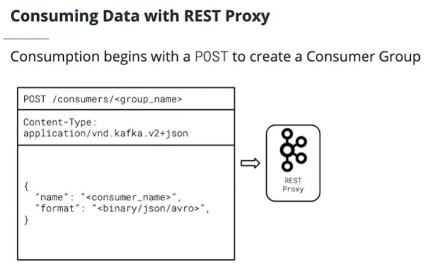
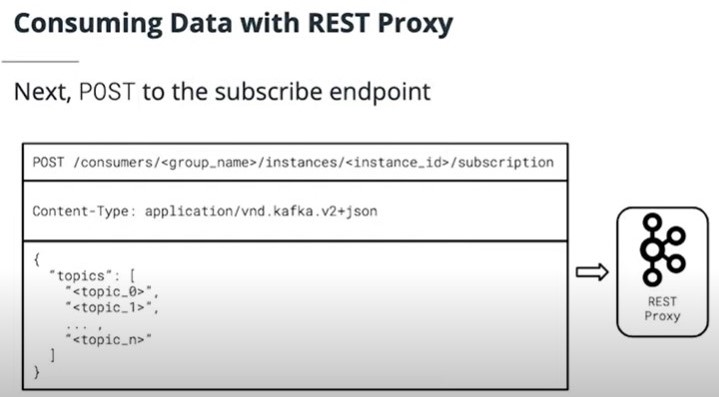
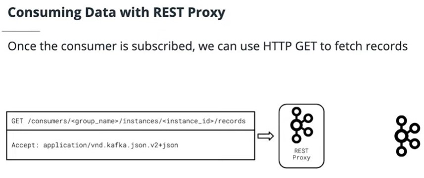

## REST Proxy Consumer
- POST to /consumers/<group_name> to create a consumer group)
- POST to /consumers/<group_name>/instances/<instance_id>/subscriptions to create a subscription-instances-(string-instance)-subscription)
- GET from /consumers/<group_name>/instances/<instance_id>/records to retrieve records-instances-(string-instance)-records)
    - Always check your Accept header to ensure that it is correctly configured
    - Content-Type is in the format application/vnd.kafka[.embedded_format].[api_version]+[serialization_format]
    - embedded_format is how the data requested from Kafka is formatted. Must be one of binary, json, or avro
    - api_version is the API version for REST Proxy -- this should always be v2 as of writing
    - serialization_format has nothing to do with your Kafka data, this is how the actual data being received from REST proxy is serialized. Only json is supported for now -- so always set this to json!
- DELETE to /consumers/<group_name>/instances/<instance_id>/subscriptions to unsubscribe a consumer-instances-(string-instance)-subscription)
