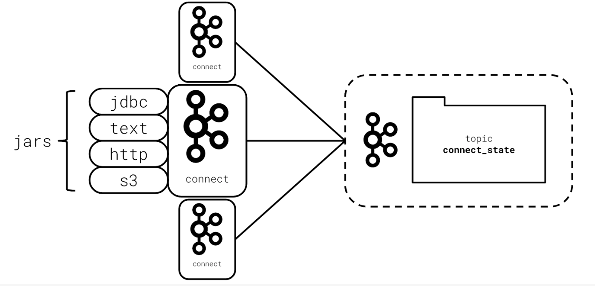

## Kafka Connect
- Kafka Connect is a web server and framework for integrating Kafka with external data sources such as SQL databases, log files, and HTTP endpoints.
- Built at Confluent, now with Apache Foundation
- Built in Java and Scala, runs on the JVM
- Can help promote reusability and keep code simple
- May not even need Kafka Client if Kafka Connect does the job

## Kafka Connection Architecture
- Kafka Connect uses Kafka as its configuration store and uses Framework JARs to provide functionality
- All plugins are JARs

## Kafka Connect Framework
- Connectors are abstractions for managing tasks
- Tasks contain the production or consumption code
- Converters map data formats to and from Connect
    - Kafka and target systems often have different formats

## Kafka Connect - Summary
In this section you learned that:

- Kafka Connect can be used to handle common and repeated scenarios.
- Kafka Connect is a web-server written in Java and Scala, and runs on the JVM.
- Kafka Connect has a plugin architecture, meaning that you can easily write your own connectors in addition to using the rich open-source ecosystem of connectors.
- By using Kafka Connect, you may be able to isolate your application entirely from integrating with a Kafka client library.

## Optional Further Reading on Kafka Connect
[Overview of Kafka Connect](https://docs.confluent.io/current/connect/concepts.html)