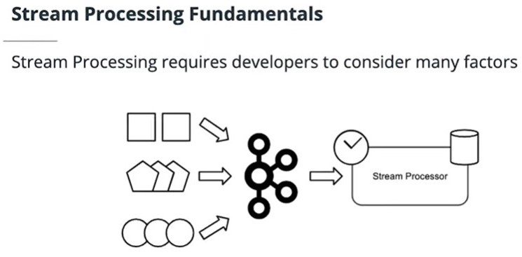

## Stream Processing Fundamentals

Stream processing applications make use of streaming data stores like Apache Kafka to provide real-time analytics. Developing an understanding of common strategies, calculations, and learning how to handle data based on time will prepare you for building these applications and getting the most out of your data.

## Stream Processing Strategies
This section introduces a number of core stream processing strategies, such as combining, filtering, aggregating, and reducing streams.