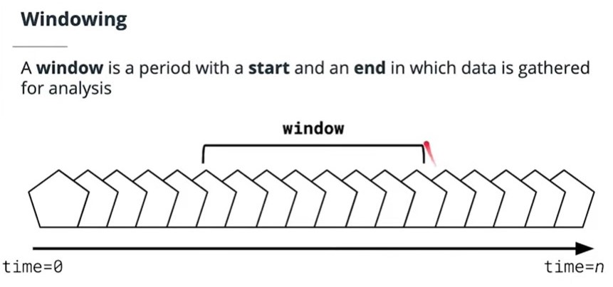

## Handling Time
Understanding time and how it applies to our data is a critical part of building a successful stream processing application. In the following sections we will review the various types of time windowing.

