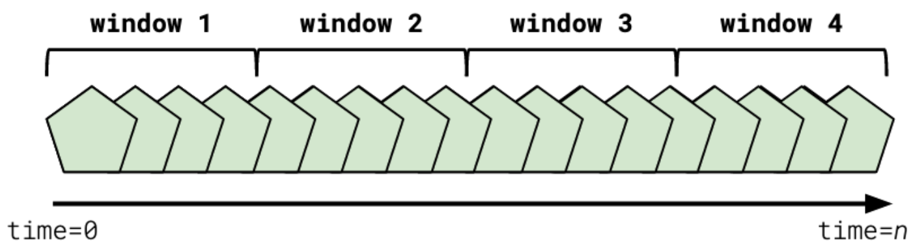

## Tumbling Window
- Tumbling windows represent a fixed period of time that rolls over after that period of time has elapsed
- ex: A 15 minute tumbling window started now would include all data from now until the 15th minute. On the 15th minute, the data is cleared and a new 15 minute window is started.
- Tumbling windows **do not overlap**
- Tumbling windows **do not have gaps** between windowed periods

