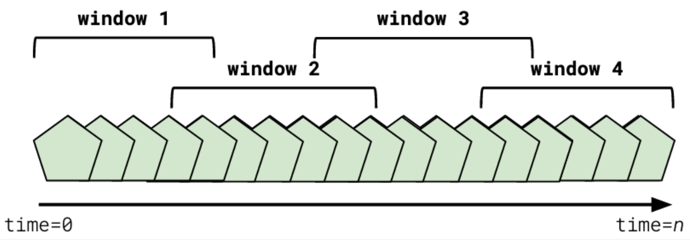

## Hopping Windows
- Hopping windows have both a **duration** and an **increment** by which they are advanced
- ex.- A window of 45 minutes with an increment of 5 minutes would advance every 5 minutes. The oldest 5 minutes of the previous window would be dropped, and the newest 5 minutes of data would be added.
- Hopping windows **can overlap** with previous windows
- Hopping windows **can have gaps** if the increment time is larger than the duration period

