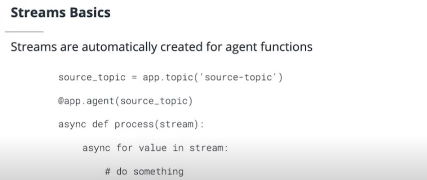
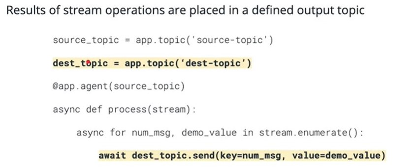

## Creating Streams with Faust
In this section you will learn how to create streams with Faust.

## Message Life Cycle and Acknowledgment
- Faust manages consumer groups and offsets
- Faust uses the aiokafka to interact with Kafka
- aiokafka manages the consumer and offsets
- Uses one underlying subscription to topics for all agents
    - if multiple agents subscribe to the same topic, Faust consumer will only fetch at once

## Faust Streams - Key Points
- [Faust streams are simply infinite asynchronous iterables which perform some processing on incoming messages](https://faust.readthedocs.io/en/latest/userguide/streams.html#id1)
- [Faust handles consumption, consumer groups, and offsets for you, in addition to managing message acknowledgements](https://faust.readthedocs.io/en/latest/userguide/streams.html#id3)
- Faust applications may choose to forward processed messages on to another stream by using the topic.send(<data>) function at the end of the processing loop.