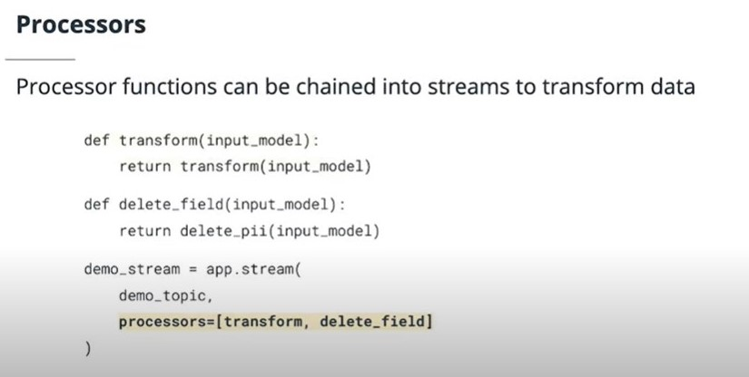

## Faust Stream Processors and Operations
Faust provides the ability to provide pre-defined processor callbacks for data streams. Processors can add missing fields, change the meaning of fields, and perform any kind of desired processing.

## Faust Processors - Key Points

- [Processors are functions that take a value and return a value and can be added in a pre-defined list of callbacks to your stream declarations](https://faust.readthedocs.io/en/latest/userguide/streams.html#id2)
- Processors promote reusability and clarity in your code
- Processors may execute synchronously or asynchronously within the context of your code
- All defined processors will run, in the order they were defined, before the final value is generated.

## Faust Operations - Key Points
- [Faust Operations are actions that can be applied to an incoming stream to create an intermediate stream containing some modification, such as a group by or filter](https://faust.readthedocs.io/en/latest/userguide/streams.html#operations)
- The **group_by** operation ingests every incoming event from a source topic, and emits it to an intermediate topic with the newly specified key
- The **filter** operation uses a boolean function to determine whether or not a particular record should be kept or discarded. Any records that are kept are written to a new intermediate stream.
- The **take** operation bundles groups of events before invoking another iteration of the stream. Be careful to specify the within datetime.timedelta argument to this function, otherwise your program may hang.
- Faust provides a number of other operations that you may use when working with your streams. Have a look at [the documentation](https://faust.readthedocs.io/en/latest/userguide/streams.html#operations) for further information.

## Faust Streams - Summary
In this section you learned how to take advantage of the Faust Streams functionality. You saw how to define stream applications in Python, manipulate incoming data streams with Faust operations, and how to define and apply reusable processing functions.

For in-depth documentation of all the concepts covered in this section of the course, please refer to the excellent [Faust documentation on streams](https://faust.readthedocs.io/en/latest/userguide/streams.html)