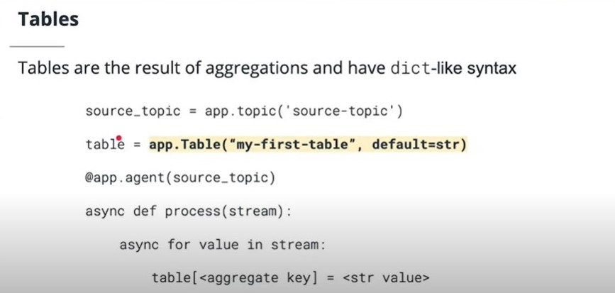
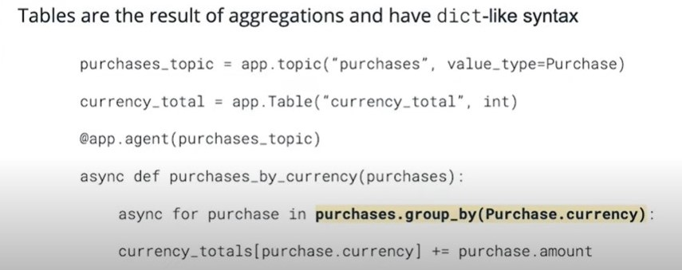

## Faust Tables
Faust provides an API for creating stateful applications with streaming Tables.

In this section, you will learn how to fully leverage the Faust Tables API.

## Faust Tables

- [Faust tables are defined with app.Table and take a table name and default type argument.](https://faust.readthedocs.io/en/latest/userguide/tables.html#basics)
- Tables must be [co-partitioned with the streams](https://faust.readthedocs.io/en/latest/userguide/tables.html#id3) they are aggregating. Use the group_by operation to ensure co-partitioning.
- Tables which are not co-partitioned may lead to inaccurate results.