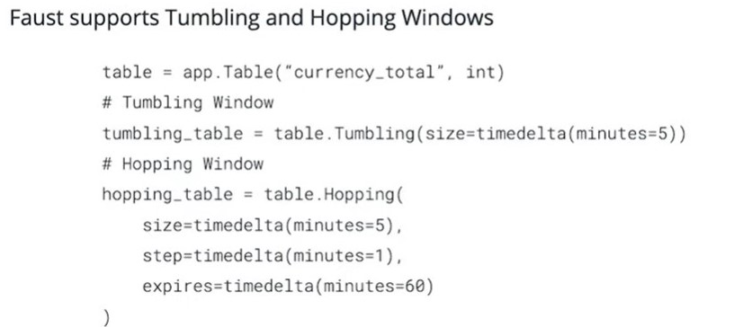

## Windowing in Faust
Faust provides two windowing methods: hopping and tumbling. In this section, you will learn how to use these windowing approaches

## Faust Windowing - Key Points

- Faust supports [Hopping](https://faust.readthedocs.io/en/latest/userguide/tables.html#HoppingWindow) and [Tumbling windows](https://faust.readthedocs.io/en/latest/userguide/tables.html#TumblingWindow)
- Windowing applies only to Tables
- Faust provides [semantics for classifying specifically which pool of data is desired from a window](https://faust.readthedocs.io/en/latest/userguide/tables.html#iterating-over-keys-values-items-in-a-windowed-table), such as current(), now(), relative_to_now(), etc.

- *From the doc*
```
In this table, table[k].now() returns 
the most recent value for the current processing window, 
overriding the _relative_to_ option used to create the window.

In this table, table[k].current() returns 
the most recent value relative to the time of the currently processing event, 
overriding the _relative_to_ option used to create the window.

In this table, table[k].value() returns 
the most recent value relative to the time of the currently processing event, 
and is the default behavior.

You can also make the current value relative to the current local time, relative to a different field in the event (if it has a custom timestamp field), or of another event.

The default behavior is “relative to current stream”:
views = app.Table('views', default=int).tumbling(...).relative_to_stream()
Where .relative_to_stream() means values are selected based on the window of the current event in the currently processing stream.
```