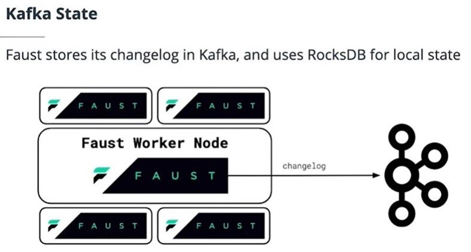

## Storage in Faust
In this section you will learn about the storage options available for Faust applications, including in-memory and RocksDB-based storage.

## Kafka State

## Storing State In Memory
- In-memory storage should only be used for test and local development
- fast, but it has to completely rebuild state from the Kafka changelog topic when it restarts

## String State in RocksDB
- The RocksDB instance runs side-by-side with the streaming processing application. 
- It simply stores the state on disk at the point of the time when changes are made.
- When the application crashes, it will reconnect RocksDB as soon as it recovers and instantly begins processing records again.
