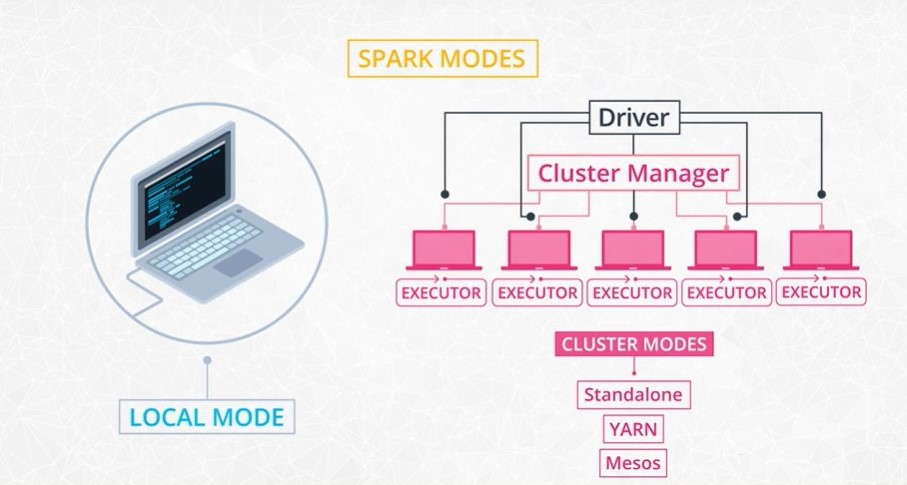

## Spark Mode

- Local Mode
    - everything happens in a single machine
    - prototyping
- Cluster Mode
    - Cluster Manager: a separate process that monitors the available resources and make sure all machines are responsive during the job
    - Three different options for cluster managers
        - Spark's Standalone
        - Hadoop's YARN - useful when sharing a cluster with a team
        - UC Berkeley's Mesos
    - Driver: in Spark's Standalone
        - If you open a Spark shell, you are directly interacting with the driver program
        - It acts as the master and is responsible for scheduling tasks that the executors perform