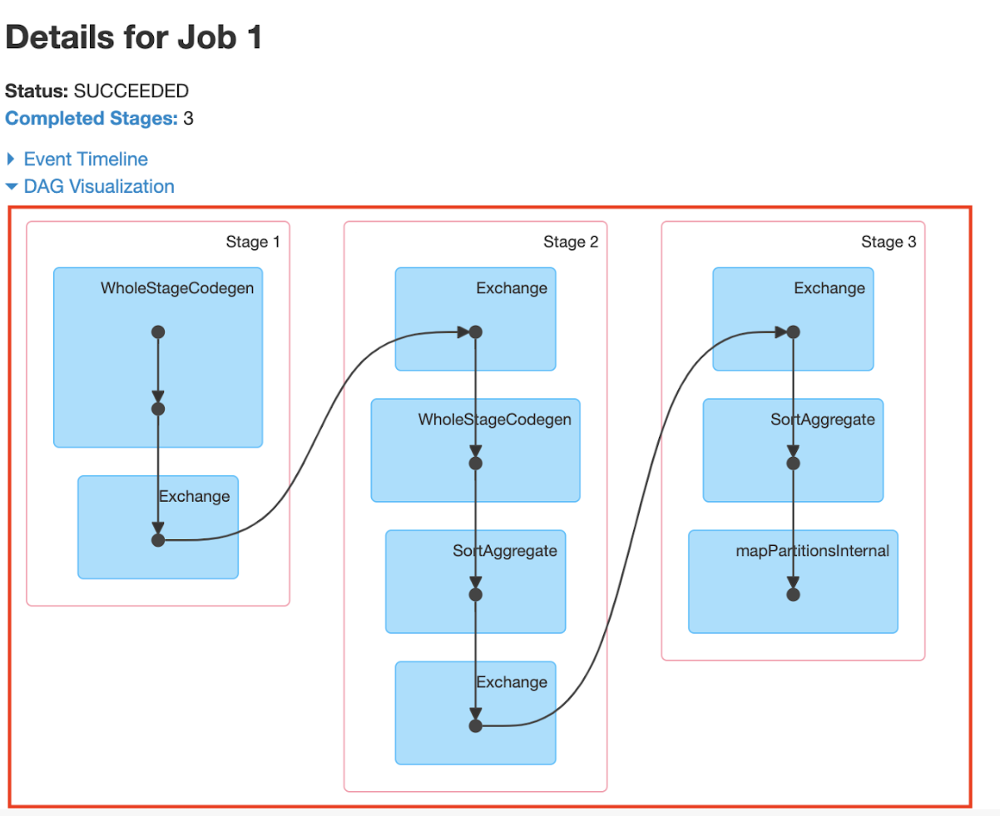

## Spark UI / DAGs Visuals with Explanations

- Red 1 - This is where your job name will be from the configuration
- Red 2 - Shows the list of action functions that were called
- Red 3 - Spark version (other configurations and Spark version can be shown from Environment tab)

## Spark UI, DAGs - Key Points

DAG is not a new concept created by Spark, rather, if you ever have taken a course about graphs, you see the concept of DAGs fairly often. Spark applied this concept with lazy evaluation and actions (which we’ll be taking a look at in the next lesson) to visualize your work in the UI.

The Spark UI becomes very important when you want to debug at system level. It tells you how many stages you’ve created, the amount of resources you’re using, logs, workers, and a lot of other useful information, like lineage graph, duration of tasks, aggregated metrics, etc.

The lineage graph is the history of RDD transformations, and it’s the graph of all the parent RDDs of the current RDD.

## Lineage Graph Example

