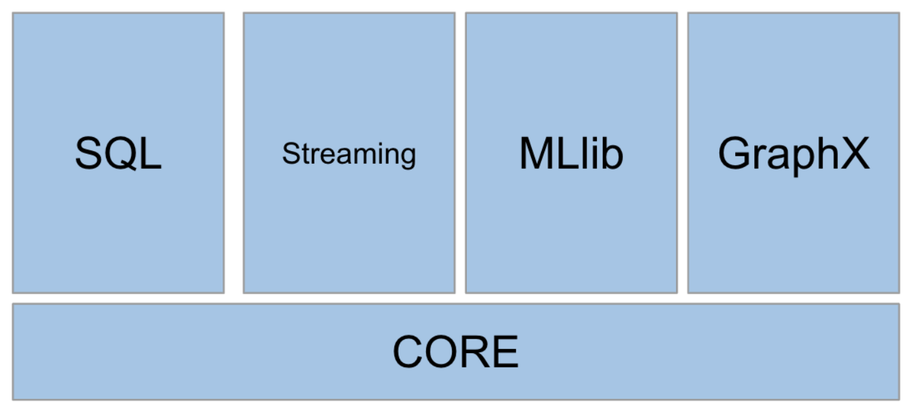

## Spark Components

### Core
Contains the basic functionality of Spark. Also home to the API that defines RDDs, which is Spark's main programming abstraction.

### SQL
Package for working with structured data. It allows querying data via SQL as well as Apache Hive. It supports various sources of data, like Hive tables, Parquet, JSON, CSV, etc.

### Streaming
Enables processing of live streams of data. Spark Streaming provides an API for manipulating data streams that are similar to Spark Core's RDD API.

### MLlib
Provides multiple types of machine learning algorithms, like classification, regression, clustering, etc. This component will not be a focus of this course.

### GraphX
Library for manipulating graphs and performing graph-parallel computations. This library is where you can find PageRank and triangle counting algorithms. This component will not be a focus of this course.