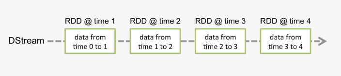

Intro to Spark Streaming and DStream
We’ve been primarily looking at batch ingestion but now we’ll start to look at streaming ingestion.

Spark DStream, Discretized Stream, is the basic abstraction and building block of Spark Streaming. DStream is a continuous stream of RDDs. It receives input from various sources like Kafka, Flume, Kinesis, or TCP sockets (we'll mostly be using sockets or Kafka). Another way of generating a Dstream is by operating transformation functions on top of existing DStream.

Another concept added in DStream is that now we're dealing with intervals (or windows).

