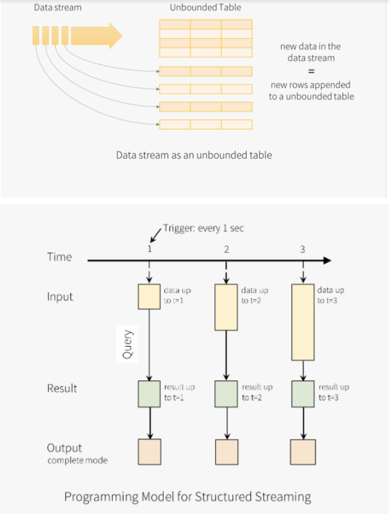

## Structured Streaming - Key Points
Structured Streaming is a programming model, introduced in Spark 2.0, to provide support for building scalable and fault-tolerant applications using Spark SQL.

Internally, Structured Streaming is processed using a micro-batch. It processes data streams as a series of small batch jobs.

With Structured Streaming, users/developers don't have to worry about specific issues related to streaming applications, like fault-tolerance, data loss, state loss, or real-time processing of data. The application can now guarantee fault-tolerance using checkpointing.

The advantages of using Structured Streaming are:

- Continuous update of the final result
- Can be used in either Scala, Python, or Java
- Computations are optimized due to using the same Spark SQL component (Catalyst)

## Structured Streaming Architecture
