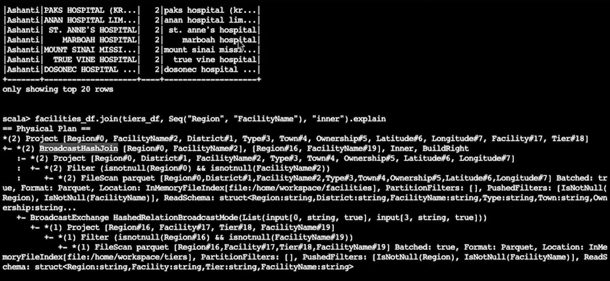
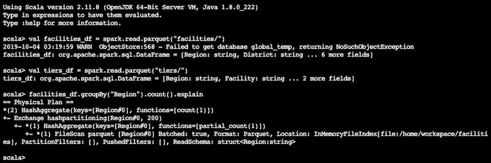

## JOIN Query Plans - Recap

For any query plan, you can apply .explain() at the end of the query to visualize the query plan. Unfortunately, this is only available in the Scala version and we’ll have to run this in the Spark-shell to visualize the query plan.

FileScan informs how the original file was scanned and loaded into the RDD. You can see the format of the file, the location of the file, and the column names (if appropriate).
Spark uses BroadcastHashJoin when the size of the data is below BroadcastJoinThreshold. In the demo, we’re using small sized data and thus we see that the JOIN query is using BroadcastHashJoin.
Project limits number of columns to those required by a union (or JOINs).

## Aggregate Query Plans - Recap

Aggregate queries can also be viewed using the .explain() operator.

Spark uses HashPartitioning on rather smaller datasets (which is what we’re using). Hash partitioning is nothing more than a partitioner using Java’s Object.hashcode.
HashAggregate is used for aggregation with HashPartitioning. If a larger dataset is used, then TungstenAggregate is used to manage data outside the JVM to save some GC (garbage collection) overhead.