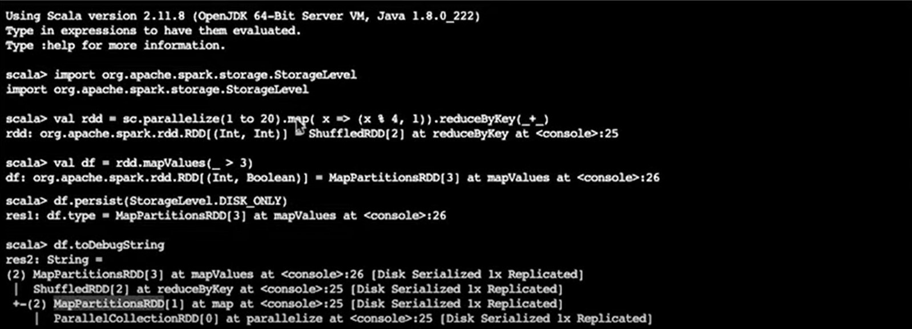
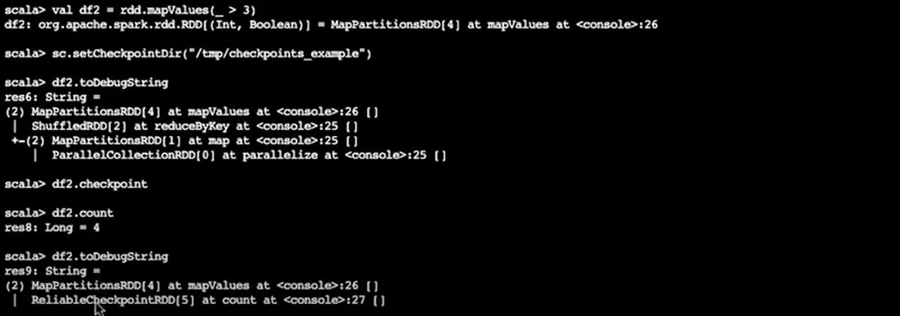

## Two types of data we checkpoint
- Metatdata (data about data)
- data (actual data)

## Checkpointing vs Persisting
- Persisting remembers RDD lineage
- Checkpointing deletes the lineage

## Persisting

## Checkpointing
