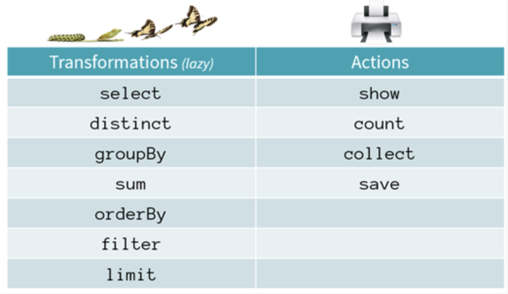

## Actions - Key Points
Actions are operations that produce non-RDD values. Actions send the values from the executors to be stored to the driver. Since the value is sent back to the driver, the final value must fit into the driver JVM. Unlike transformations, which are lazily evaluated, actions evaluate the expression on RDD.

A few action functions that are used often are:
- save()
- collect()
- count()
- reduce()
- getNumPartitions()
- aggregate()

