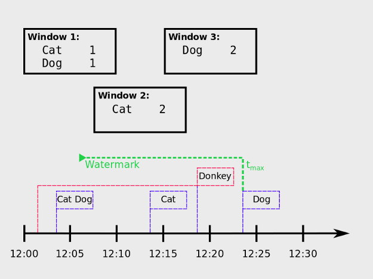
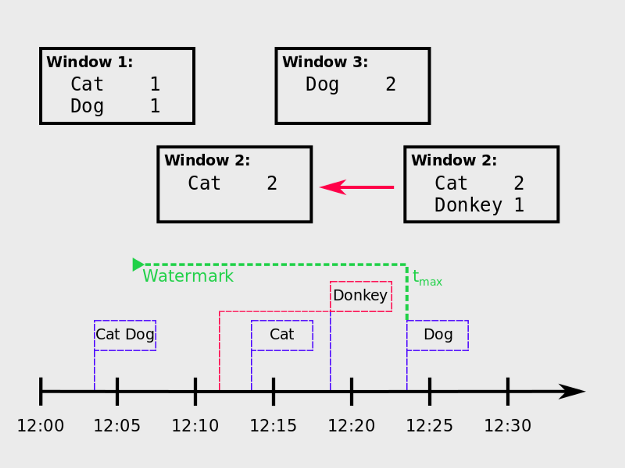
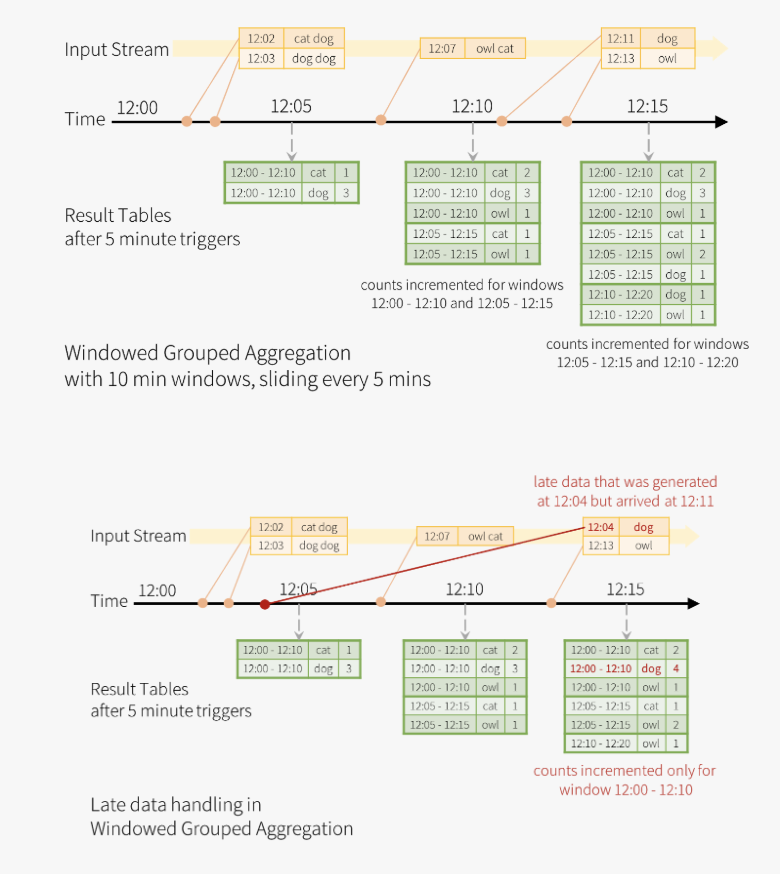

## Watermark
Computation
- Max(event_time seen by the engine) - delay_threshold > T
- max eventTime is the latest event time seen by the engine
- T is the starting time of a window

Handle Two problem
- Determine which data can be accepted in the pipeline
- Discard state that is too old from the state store

Specify two elements to compute watermark
- Column defining event time
- Value for delay threshold

source: https://towardsdatascience.com/watermarking-in-spark-structured-streaming-9e164f373e9

## Recap on JOINs, Aggregation, and Watermark
JOINs, Aggregation, and Watermark are all commonly used Structured Streaming APIs.

## Types of JOINs
In streaming, we have to think about static vs. streaming DataFrames. Inner JOINs can be easily applied to static and streaming DataFrames, regardless of which one is the left or right table. Outer JOINs are much more difficult because we have to think about late arriving data, and to join on late arriving data, the results will be significantly inconsistent.

## Aggregation vs. Stateful Aggregation
You can think of aggregation as a plain sum() or count() in a SQL query. Stateful aggregation involves intervals, which means aggregation over certain intervals. We apply the concept of watermark to achieve stateful aggregation.

## Watermark
Watermark addresses two main problems - dealing with late arriving data and stateful aggregation. Watermark decides which data can be dropped or included - this implies that the application doesn’t have to worry about deciding which data should be ingested in the pipeline, rather, watermark already acknowledges which data can be ingested. Also you can achieve stateful aggregation by setting watermark.

