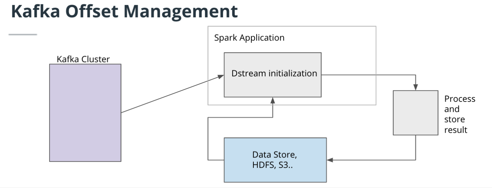
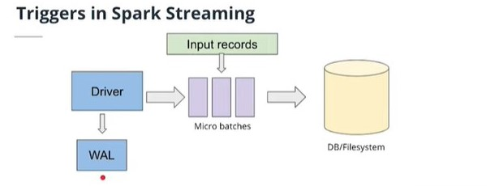

## Kafka Offset Reader

KafkaOffsetReader is a class within Spark that uses Kafka's own KafkaConsumer API to read Kafka offsets. This class uses the ConsumerStrategy class that defines which Kafka topic and partitions should be read. ConsumerStrategy is another useful class to specify a fixed collection of partitions and to subscribe to a fixed collection of topics.

You will be using KafkaOffsetReader closely with KafkaSourceProvider.

## Triggers in Spark Streaming - Key Points

- Spark structured streaming default behavior is reading stream as a micro batch
- Incoming records are grouped into small windows and processed in a periodic fashion
- Write Ahead Logs enforce fault-tolerance by saving logs to a certain checkpoint directory. Enabling WAL can be done by using the Spark property, spark.streaming.receiver.writeAheadLog.enable.
- Spark Triggers determine how often a streaming query needs to be executed. The trigger can be set using a few options in the query builder.

## Exercise: Exploring Triggers (trigger_variation.py)
Using the Kafka Server and Structured Streaming application, we will now play with the triggers.