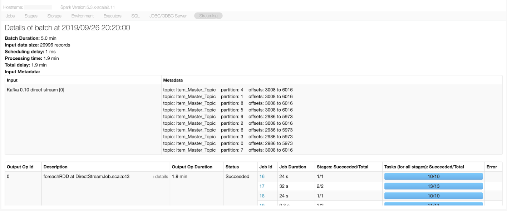

## Structured Streaming on Spark UI
We have looked at various ways of using the Spark UI to monitor and debug Spark applications. How can we monitor and debug Streaming applications?

While the streaming application is running, you’ll see a “Streaming” tab (see image below). This tab in the UI enables you to concurrently monitor your job.

The “Streaming” tab contains some information about Spark & Scala versions, but it also shows what kind of streaming data you’re ingesting from (in the example below, Kafka stream), number of offsets in each partition, and also input rate of the data.

