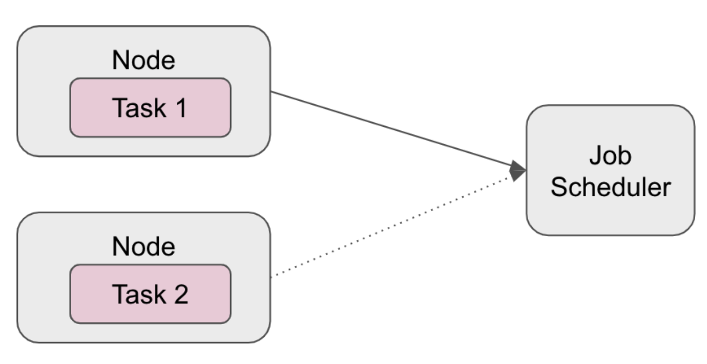

## Scenario 2
Other methods of improving your Spark application are by improving system stability and studying your data.

When the heap gets very big (> 32GB), the cost of GC (garbage collection) gets large as well. We might see this when the join application runs with large shuffles (> 20GB), and the GC time will spike.

Can you use a sample of your data? How about using salting or broadcasting? Let’s discuss these below.

In the ideal world, when you operate a join on your dataset, join keys will be evenly distributed and each partition will be nicely organized. In the real world, uneven partitioning is unavoidable due to the nature of your dataset.

Using the Spark UI (or even just your logs), you'll commonly see the errors below:
- Frozen stages
- Low utilization of CPU (workers not working)
- Out of memory errors

Carefully studying your data, to minimize the skewed data problem, we can try the following:
- Broadcasting: You can increase the autoBroadcastJoinThreshold value in spark.sql property so that the smaller tables get “broadcasted.” This is helpful when you have a large dataset that will not fit into your memory.
- Salting: If you have a key with high cardinality, your dataset will be skewed. Now you introduce a “salt,” modifying original keys in a certain way and using hash partitioning for proper redistribution of records.

Now that we have cleaned up our data and the skew problem as much as we could, and also assuming that our code is optimized, let’s talk about how we can stabilize the system through a couple of different methods:
- Auto scaling
- Speculative execution

Auto scaling is only doable with cloud clusters as you can always add more nodes freely. Two popular tech stacks that are used are AWS Auto Scaling (if AWS EMR clusters are used) or auto scaling with Kubernetes (a container-orchestration system).

Speculative execution is another popular addition to stabilize and reduce bottleneck-like threshold. Speculative execution in Spark detects the “speculated task” (which means this task is running slower than the median speed of the other tasks), and then submits the “speculated task” to another worker. This enables continuous parallel execution rather than shutting off the slow task.

## Notes on Scenario 2 diagram below
In this sample image below, let’s say task 1 and 2 are identical to each other. In fact, task 2 is a duplicate of task 1. In the node that contains task 1, if the task is seen to be slower than the median speed, then the job scheduler launches the task 2 (duplicate of task 1) in another node.

If the duplicate task is faster, the result of task 2 will be submitted to the job scheduler. If the original task is faster, then the result of task 1 will be used. In Spark UI, whichever node that was killed due to late execution will be noted as killed intentionally.

