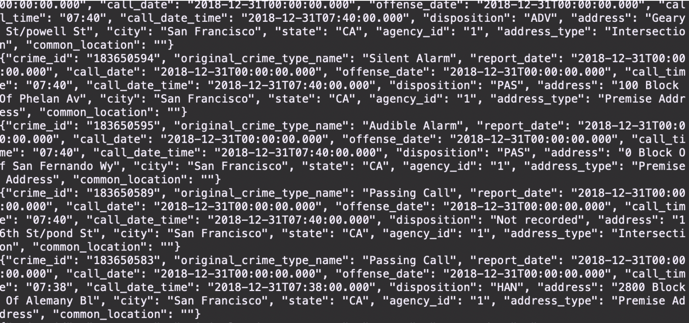

## Installation
- scala 2.12.12
- kafka_2.12-2.6.0
- spark-3.0.1-bin-hadoop2.7
- java 11

## Custom configuration for Kafka
- create folder `data/kafka` and `data/zookeeper` under kafka-installed dir(ex. kafka_2.12-2.6.0)
- edit /kafka_2.12-2.6.0/config/server.properties  
`log.dirs=/some/path/kafka_2.12-2.6.0/data/kafka`
- edit /kafka_2.12-2.6.0/config/zookeeper.properties  
`dataDir=/some/path/kafka_2.12-2.6.0/data/zookeeper`

## Start Kafka
bin/zookeeper-server-start.sh config/zookeeper.properties
bin/kafka-server-start.sh config/server.properties

## Check
bin/kafka-topics.sh --list --zookeeper localhost:2181
bin/kafka-console-consumer.sh --bootstrap-server localhost:9092 --topic <topic> --from-beginning

## Create a topic
kafka-topics.sh --create \
  --zookeeper localhost:2181 \
  --replication-factor 1 --partitions 1 \
  --topic sf.police.calls

## Delete a topic
bin/kafka-topics.sh --zookeeper localhost:2181 --delete --topic sf.police.calls

## Kafka-python library
- https://pypi.org/project/kafka-python/
- pip3 install kafka-python

## Starter Code
You can find three Python files that are starter code, the project dataset, and some other necessary resources in a zip file called "SF Crime Data Project Files" in the Resources tab in the left sidebar of your classroom:
- producer_server.py
- kafka_server.py
- data_stream.py
- police-department-calls-for-service.json
- radio_code.json
- start.sh
- requirements.txt

These files are also included in the Project Workspace.

## Files You Need to Edit in Your Project Work
These starter code files should be edited:
- producer_server.py
- data_stream.py
- kafka_server.py

The following file should be created separately for you to check if your kafka_server.py is working properly:
- consumer_server.py

## Create a GitHub Repository
Create a new repo that will contain all these files for your project. You will submit a link to this repo as a key part of your project submission. If you complete the project in the classroom workspace here, just download the files you worked on and add them to your repo.

## Beginning the Project
This project requires creating topics, starting Zookeeper and Kafka servers, and your Kafka bootstrap server. You’ll need to choose a port number (e.g., 9092, 9093..) for your Kafka topic, and come up with a Kafka topic name and modify the zookeeper.properties and server.properties appropriately.

### Local Environment
- Install requirements using `./start.sh` if you use conda for Python. If you use pip rather than conda, then use `pip install -r requirements.txt`.
- Use the commands below to start the Zookeeper and Kafka servers. You can find the bin and config folder in the Kafka binary that you have downloaded and unzipped.
```
bin/zookeeper-server-start.sh config/zookeeper.properties
bin/kafka-server-start.sh config/server.properties
```
You can start the bootstrap server using this Python command: `python producer_server.py`.

## Workspace Environment
- Modify the zookeeper.properties and producer.properties given to suit your topic and port number of your choice. Start up these servers in the terminal using the commands:
```
/usr/bin/zookeeper-server-start zookeeper.properties
/usr/bin/kafka-server-start producer.properties
```
- You’ll need to open up two terminal tabs to execute each command.
- Install requirements using the provided ./start.sh script. This needs to be done every time you re-open the workspace, or anytime after you've refreshed, or woken up, or reset data, or used the "Get New Content" button in this workspace.
- In the terminal, to install other packages that you think are necessary to complete the project, use conda install <package_name>. You may need to reinstall these packages every time you re-open the workspace, or anytime after you've refreshed, or woken up, or reset data, or used the "Get New Content" button in this workspace.

## Step 1
- The first step is to build a simple Kafka server.
- Complete the code for the server in producer_server.py and kafka_server.py.

### Local Environment
- To see if you correctly implemented the server, use the command below to see your output.
```
bin/kafka-console-consumer.sh --bootstrap-server localhost:<your-port-number> --topic <your-topic-name> --from-beginning
``` 
### Workspace Environment
- To start kafka-consumer-console, use the command  
```
/usr/bin/kafka-consumer-console.
```
- Take a screenshot of your kafka-consumer-console output. You will need to include this screenshot as part of your project submission.  


## Step 2
- Apache Spark already has an integration with Kafka brokers, so we would not normally need a separate Kafka consumer. However, we are going to ask you to create one anyway. Why? We'd like you to create the consumer to demonstrate your understanding of creating a complete Kafka Module (producer and consumer) from scratch. In production, you might have to create a dummy producer or consumer to just test out your theory and this will be great practice for that.
- Implement all the TODO items in data_stream.py. You may need to explore the dataset beforehand using a Jupyter Notebook.
- Do a spark-submit using this command: 
```
spark-submit --packages org.apache.spark:spark-sql-kafka-0-10_2.11:2.3.4 --master local[*] data_stream.py
```
- Take a screenshot of your progress reporter after executing a Spark job. You will need to include this screenshot as part of your project submission.
- Take a screenshot of the Spark Streaming UI as the streaming continues. You will need to include this screenshot as part of your project submission.

### How to find value for option *--packages*
- the spark-submit command above won't work since I am using different version of Spark/Kafka
- https://docs.cloudera.com/runtime/7.2.0/running-spark-applications/topics/spark-submit-options.html
- Comma-separated list of Maven coordinates of JARs to include on the driver and executor classpaths. The local Maven, Maven central, and remote repositories specified in repositories are searched in that order. The format for the coordinates is groupId:artifactId:version.
- https://mvnrepository.com/artifact/org.apache.spark/spark-sql-kafka-0-10_2.12/3.0.1
- spark-submit command that is working for me
```
spark-submit --packages org.apache.spark:spark-sql-kafka-0-10_2.12:3.0.1 --master local[*] data_stream.py
```


## Step 3
Write the answers to these questions in the README.md doc of your GitHub repo:
1. How did changing values on the SparkSession property parameters affect the throughput and latency of the data?

not SparkSession property, but number of partitions of the Kafka topic
maxOffsetsPerTrigger
maxRatePerPartition
spark.driver.memory / default 1g
spark.executor.memory / default 1g
spark.default.parallelism


1. What were the 2-3 most efficient SparkSession property key/value pairs? Through testing multiple variations on values, how can you tell these were the most optimal?


## Project Submission
You will submit a link to your GitHub repo, with the files you've created: producer_server.py, kafka_server.py, data_stream.py, and consumer_server.py. The README.md doc in your GitHub repo should contain your responses to the two questions from Step 3.

Your project submission should also include a zip file containing the three screenshots you've taken.


