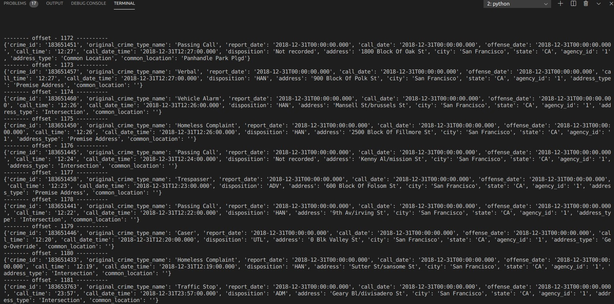
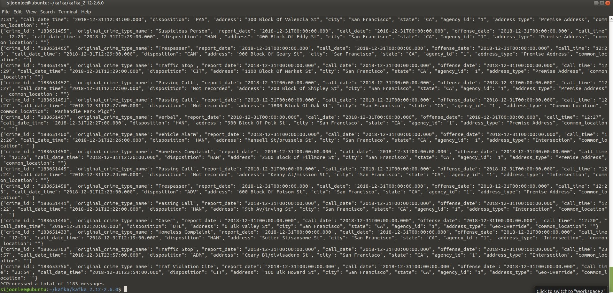
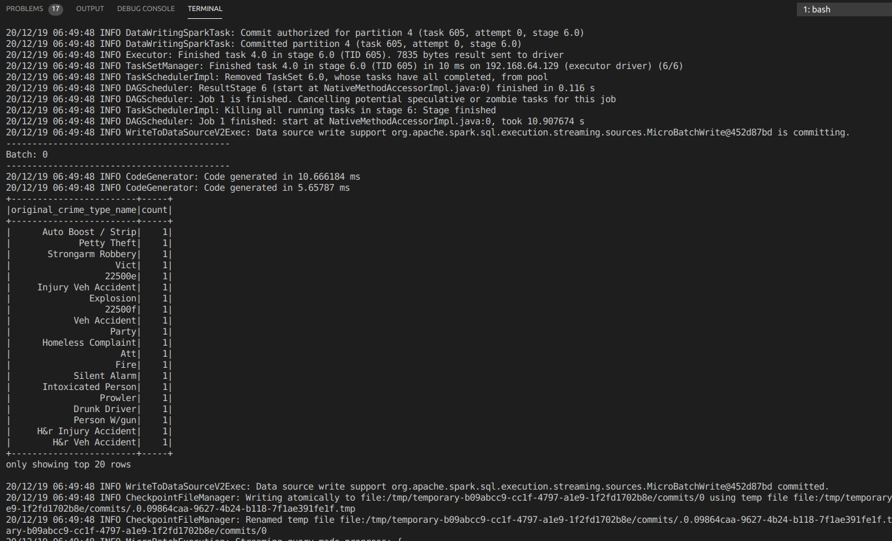

## Installation
- I know this is not the installation setting that the course instructs, but I believe my codes would work for the course's setting since python code won't have difference for both settings.
- kafka_2.12-2.6.0
    - kafka 2.6.0 doesn't support scala 2.11, but scala 2.12 and 2.13
- spark-3.0.1-bin-hadoop2.7
    - spark 2.12 is supported
- scala 2.12.12
    - scala 2.12 is chosen here
- java 11

## Start Kafka
- all default setting
>bin/zookeeper-server-start.sh config/zookeeper.properties  
>bin/kafka-server-start.sh config/server.properties

## Produce
>python kafka_server.py

## Consume
### using python code
>python consumer_server.py  

### using console command
>bin/kafka-console-consumer.sh --bootstrap-server localhost:9092 --topic sf.police.called --from-beginning  

## Spark-submit
- Below is the command I used since different installations were used
>spark-submit --packages org.apache.spark:spark-sql-kafka-0-10_2.12:3.0.1 --master local[*] data_stream.py

- But I believe below command that the course provides still works
>spark-submit --packages org.apache.spark:spark-sql-kafka-0-10_2.11:2.3.4 --master local[*] data_stream.py  

## Spark UI
- Job Tab

- Stage Tab

- Executor Tab

- Kafka Topic with the Number of Partition = 1, SparkSession maxRatePerPartition = 10, maxOffsetsPerTrigger = 200

- Kafka Topic with the Number of Partition = 3, SparkSession maxRatePerPartition = 10, maxOffsetsPerTrigger = 200

- Kafka Topic with the Number of Partition = 3, SparkSession maxRatePerPartition = 30, maxOffsetsPerTrigger = 200

- Kafka Topic with the Number of Partition = 3, SparkSession maxRatePerPartition = 30, maxOffsetsPerTrigger = 400

## Q1. How did changing values on the SparkSession property parameters affect the throughput and latency of the data?
There are several factors among SparkSession properties that can affect throughput and latency such as
- maxOffsetsPerTrigger
- maxRatePerPartition
- spark.driver.memory / default 1g
- spark.executor.memory / default 1g
- spark.default.parallelism

Parallelism might be a powerful factor, but I am working this project on VM and my VM has limit on parallelism - From another courses, I've already confirmed it doesn't fully harness the multi-core power.

Memory wasn't an issue in this particular project considering the input data size. The total size of json file is around 100MB, but spark.driver.memory and spark.executor.memory are set to 1g by default.

maxOffsetsPerTrigger is the critical factor when using trigger, particularly for the initial delay. 

Although it is not managed in SparkSession properties, the number of partitions of the Kafka topic was important factor. As you can see in the above pictures of Spark UI, increasing from 1 to 3 boosted the speed. 
- Maximum process rate was ~ 7 records/sec when # partition = 1.
- Maximum process rate was ~ 9 records/sec when # partition = 3.

It seems maxRatePerPartition hasn't affected the speed much 
- as shown in comparison partition = 3 & maxRatePerPartition = 10 with partition = 3 & maxRatePerPartition = 30
- there wasn't big difference, I think it was because maxOffsetsPerTrigger was already bottleneck.

Changing maxOffsetsPerTrigger from 200 to 400 improved the speed
- both input speed and process speed increased significantly

## Q2. What were the 2-3 most efficient SparkSession property key/value pairs? Through testing multiple variations on values, how can you tell these were the most optimal?

- I believe spark.default.parallelism would benefit the most if configured well. But my local machine doesn't have many cores and vm doesn't support multi-core well. 

- In my experiment, the most significant factor was maxOffsetsPerTrigger. Increasing it from 200 to 400 boosted the maximum process speed almost 1.8 times. 

- the number of partitions in Kafka topic affects the processing speed greatly. 3 was much better than 1
